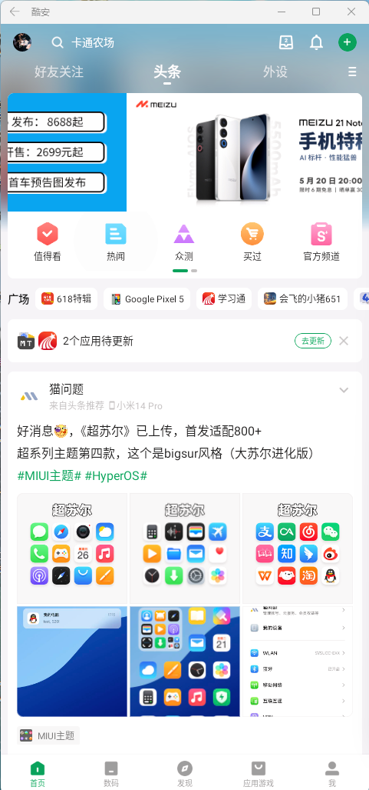
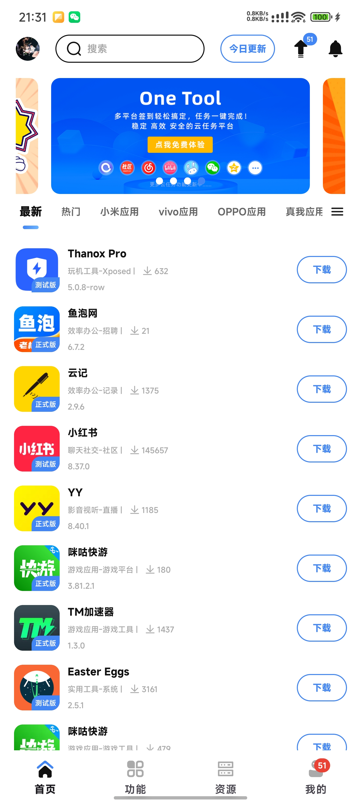
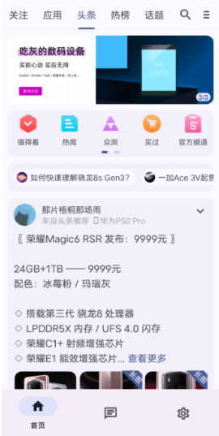
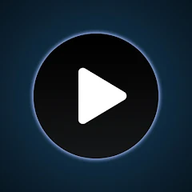
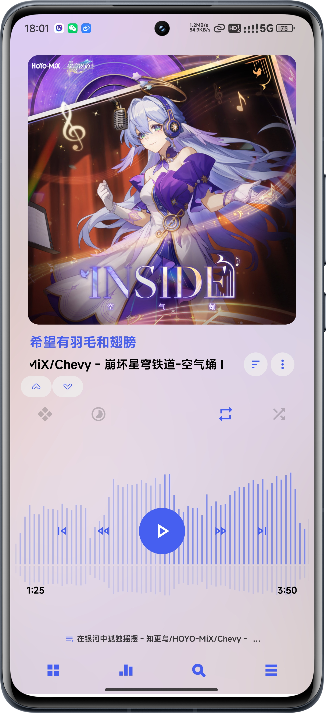
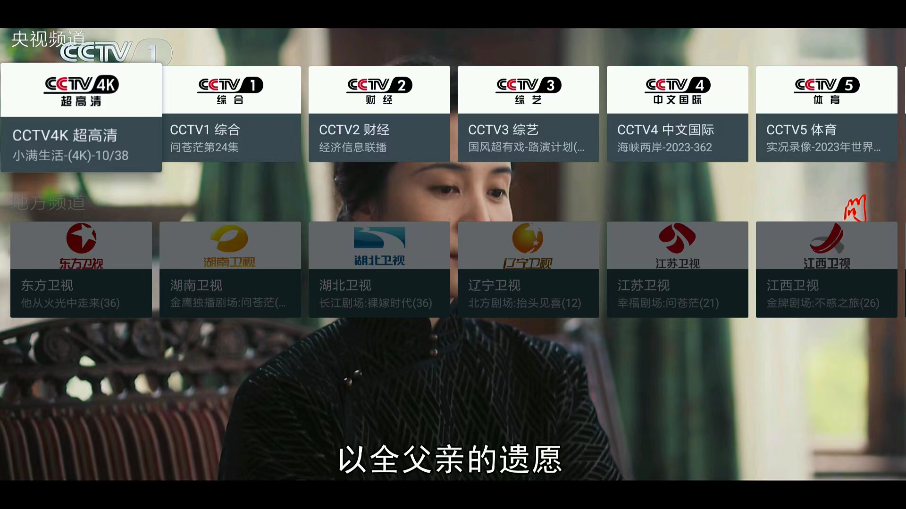
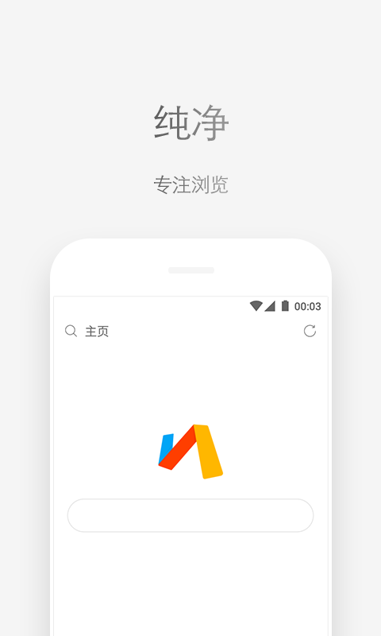
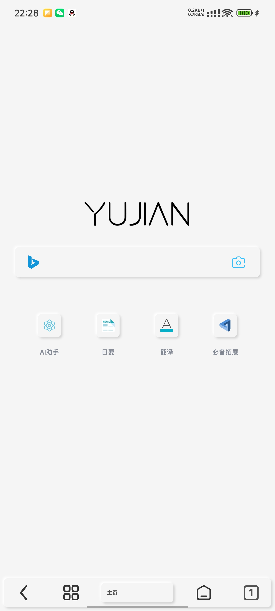
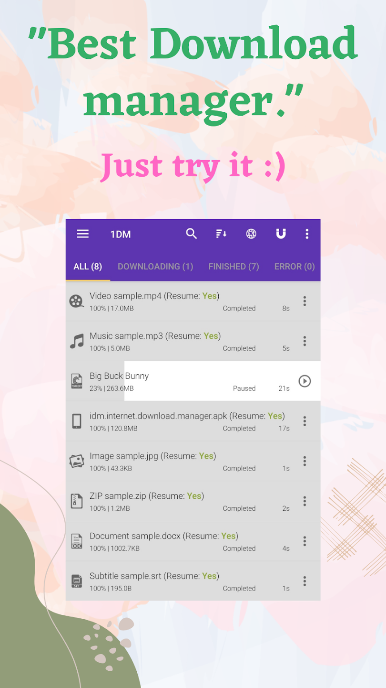

# 好软推荐
## 好用的商店
### Google play store / 外区AppStore

- 安卓和苹果必备，没有就准备坐牢吧
- 当然你也可以选择自己手动下
### 酷安

#### 介绍
- 之前的机圈讨论的地方，现在的小绿书，环境十分差劲。
- 如果作为一个找资源和教程的地方，不看头条还是很可以的
#### 下载地址
- 官网：[酷安 - 发现科技新生活 (coolapk.com)](https://www.coolapk.com/)
### APP share

#### 介绍
- 一款优秀的软件下载平台，得益于强大的社区，能见到大量的提取、测试、破解版本和找不到的软件。
- 就是要签到或者氪金。
#### 下载方式
- 官网 [AppShare-牧歌信息](https://appshare.vip/)
### C001apk

#### 介绍
- 优秀的第三方酷安，没有广告，M3设计风格，界面美观。
- 已停更，无法发动态和评论。
#### 下载地址
- 不公开
## 机场软件
### surfboard 

#### 介绍
- 速度快、功能多且cfa停止更新
#### 安装方式：
- Google：[Surfboard - Google Play 上的应用](https://play.google.com/store/apps/details?id=com.getsurfboard)
- Github: [Releases · getsurfboard/surfboard (github.com)](https://github.com/getsurfboard/surfboard/releases)
## 音乐软件
### poweramp

#### 介绍
本地音乐播放器，好看简洁干净，但是收费，这个软件很强大，但需要一些插件来实现，在酷安有人发破解版。
#### 安装方式
- 官网：[Poweramp – Music Player for Android (powerampapp.com)](https://powerampapp.com/)
- Google：[Poweramp - Google Play 上的应用](https://play.google.com/store/apps/details?id=com.maxmpz.audioplayer)
## 视频软件
### MXplayer

#### 介绍
优秀且强大的本地视频播放器，可以普通版有广告，界面不美观。
#### 安装方式：
- Google：[MX Player: Video Player & OTT - Google Play 上的应用](https://play.google.com/store/apps/details?id=com.mxtech.videoplayer.ad&gl=IN)
###  Mytv

#### 介绍
如果你要看电视台直播，这就是最好的一个了。除了手机，电视也可以装个这个用。
#### 安装方式：
- GitHub：[lizongying/my-tv: 我的电视 电视直播软件，安装即可使用 (github.com)](https://github.com/lizongying/my-tv)
- Gitee：[my-tv 发行版 - Gitee.com](https://gitee.com/lizongying/my-tv/releases/)
### BBLL

#### 介绍
第三方B站，专为大屏设计，专门给平板以及电视设备使用，对遥控器进行了适配，干净整洁无广告。可以登录，功能也较为齐全，动态、主页、收藏和直播等核心功能都不少。
#### 安装方式
- GitHub：[xiaye13579/BBLL: 一个第三方哔哩哔哩客户端，A third-party bilibili client。 (github.com)](https://github.com/xiaye13579/BBLL)
### 纯粹直播

#### 介绍
- 一个软件，全部平台集齐，还没有广告，爽。
#### 安装方式
- GitHub [liuchuancong/pure_live: 纯粹直播:哔哩哔哩/虎牙/斗鱼/快手/抖音/网易cc/M38自定义源应有尽有。 (github.com)](https://github.com/liuchuancong/pure_live)
## 浏览器
### VIA

#### 介绍
- 最干净整洁、体积最小、速度极快的浏览器，支持一些插件与脚本。
- 基于webview，别忘了更新webview，否则小心网页打不开
#### 下载
- 国内各大应用商店
- Google [Via浏览器 – 简洁轻快浏览器 – 极客之选 - Google Play 上的应用](https://play.google.com/store/apps/details?id=mark.via.gp)
### 雨见/可拓

#### 介绍
- 优秀的浏览器，支持Firefox、edge、chrome的插件
- 使用Firefox与webview双内核。
- 支持与各大浏览器同步
- 自带的功能也很优秀
#### 下载
- 国内各大应用商店
- Google [雨见浏览器 - Google Play 上的应用](https://play.google.com/store/apps/details?id=com.yjllq.internet)
- Google [可拓浏览器 - 用拓展完善你的浏览器- Google Play 上的应用](https://play.google.com/store/apps/details?id=com.yjllqint.kito)
## 下载器
### 1DM+

#### 介绍
- 十分优秀的下载器，支持多种格式，包括种子，最大32线程，速度极快。
- 需要花钱购买，酷安有人破解
#### 下载
- Google [1DM+: Browser & Video Download - Google Play 上的应用](https://play.google.com/store/apps/details?id=idm.internet.download.manager.plus)
## 其他内容
敬请期待
