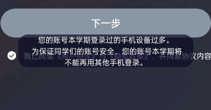
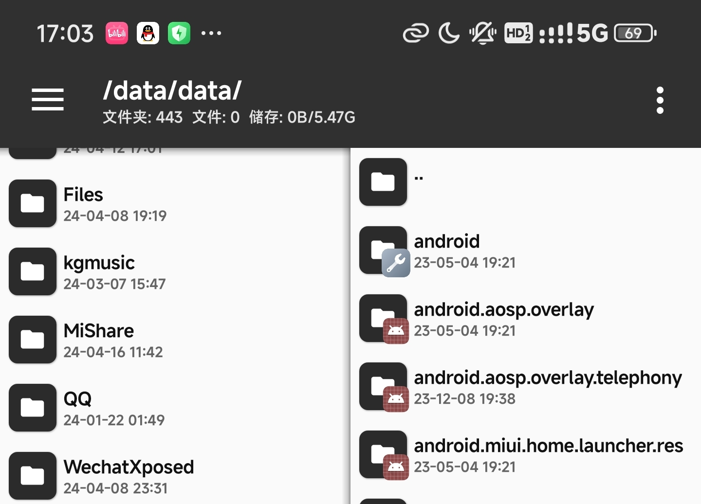
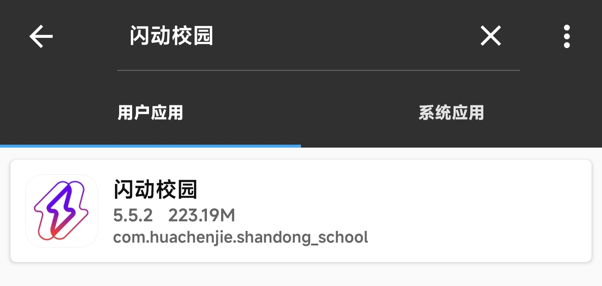
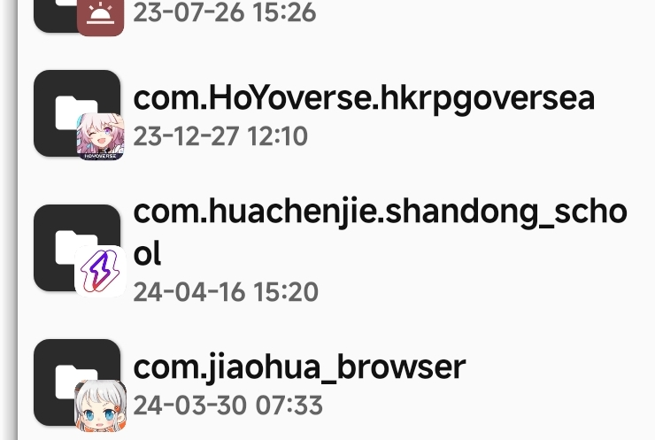
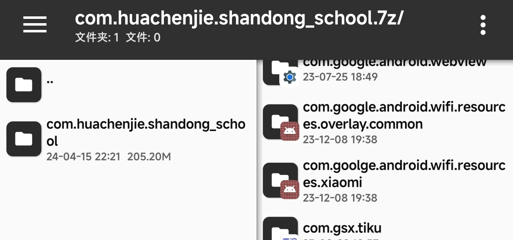
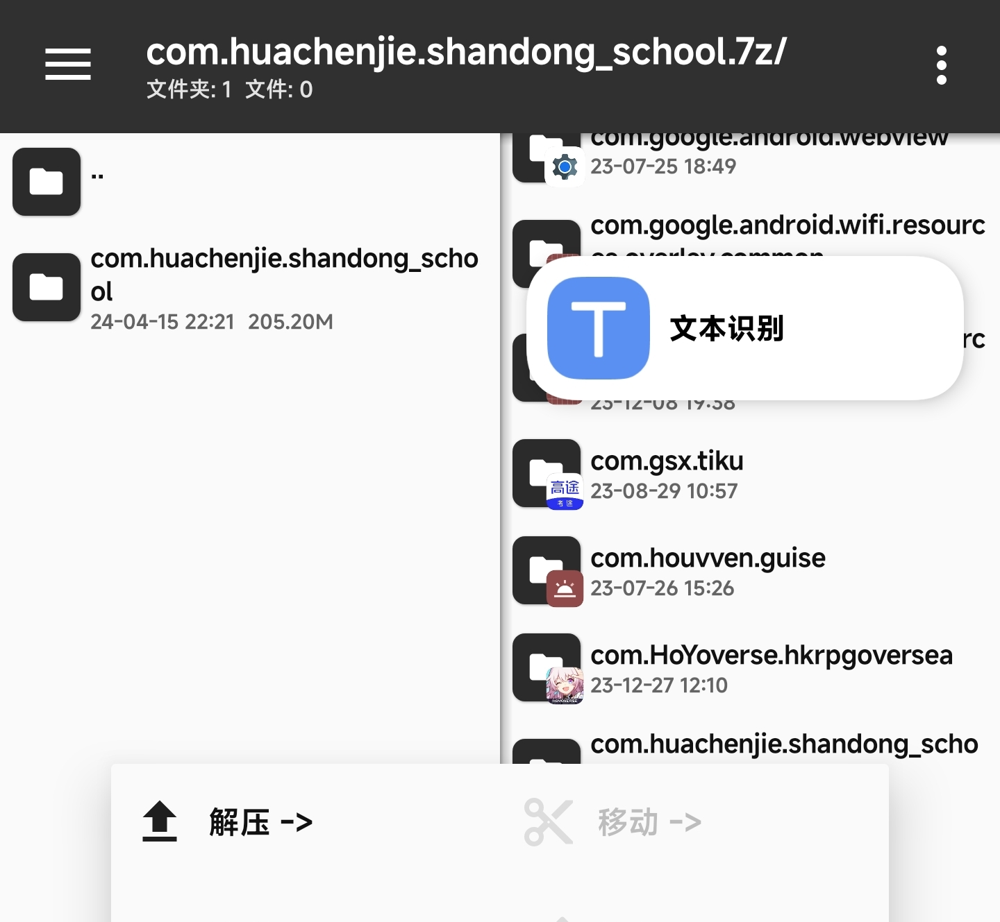

### 问题出现
我之前手机上有闪动校园，后来觉得主力机太重，用备用的老机子跑，后来老机子出问题，跑着跑着重启，只好重新拿主力机来跑。但是目前我登录不上，登录过的设备也不行。应该是删除一次，就不能用了。

查看学校的文件，说是检测IP，IP我记得是动态的，应该不可能根据这个。
于是我想到了最暴力的方案，我直接把数据拷过去，不久行了。
### 前提准备
- 两台手机均已root
- 之前登录过的机子还在登录
### 操作方案
1. 手机app的数据，一般保存在/data/data中，打开mt，找到对应文件夹

2. 找到要拷的软件的包名，MT右上角菜单，找到APP提取，搜索你要找的软件，下面会显示对应的包名，比如闪动校园的包名，com.huachenjie.shandong_school

3. 找到对应包名的文件夹

4. 拷到你准备的文件夹，选中压缩，格式随便，我用的是7z。

5. 将这个文件传到另一个手机里，我用的是互传。
6. 传到后，直接点击这个文件，进入压缩包里，另一边进入/data/data，直接长按压缩包的文件，出现选项，直接解压过去。如询问，全部替换。

7. 点击对应的软件，发现没有验证了，甚至直接登录上去了（直接之前的把软件的数据拷过来了）。
### 多开
多开的数据，存在了
data/user/999/里
### 制作
- xiangyu2233
- 如使用或参考请标明出处。